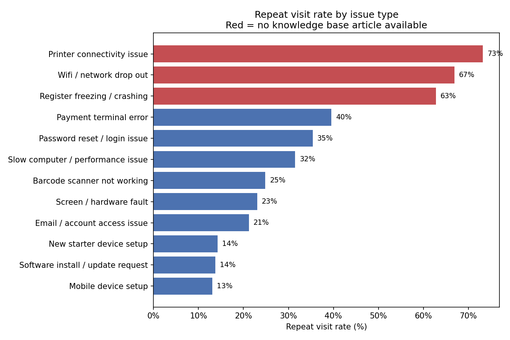
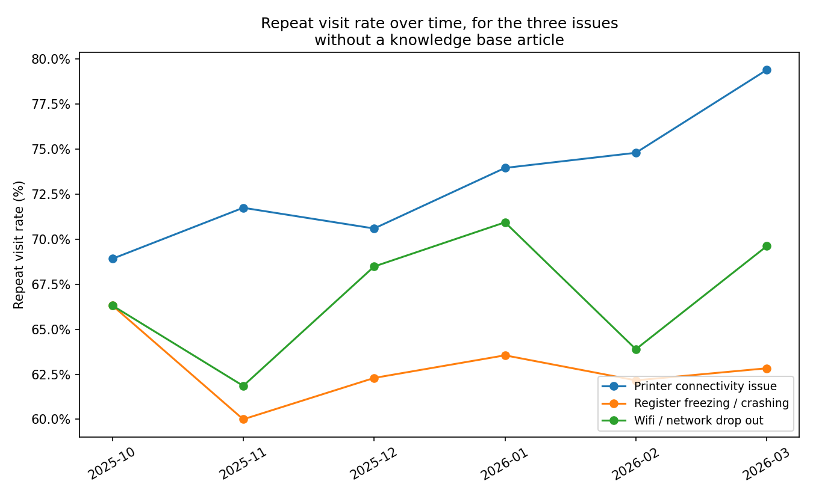

# Closing the Knowledge Gap
### A Data Driven Look at Repeat Visits in Retail Tech Support

**By Prachi Agarwal**
[linkedin.com/in/prachiagarwal66](https://www.linkedin.com/in/prachiagarwal66)

---

### A Note on the Data

This project was built using a realistic, simulated dataset of retail technology support tickets, modeled closely on the kind of work I do in my current role at a national retail technology team. I was not able to use real company data for this project, so the patterns shown here are constructed to reflect typical retail support situations rather than measured from a live system. The method, the analysis, and the recommendation are exactly how I would approach a real version of this problem.

---

## 1. The Business Problem

Retail technology support teams handle a high volume of tickets every week, covering everything from desktops and laptops to registers, network equipment, and mobile devices. A common and costly issue in these teams is the repeat visit: a customer or staff member reports a problem, the team attends to it, but the same issue comes back a second time because the first visit did not fully resolve it.

Repeat visits are expensive. Each one costs staff time, slows down the store, and adds frustration for both customers and the team. My question for this project was simple:

> **Which issue types are causing the most repeat visits, and is there a clear, fixable reason why?**

Based on my own experience building knowledge base articles and troubleshooting videos in my current role, I suspected the answer would come down to one thing: whether or not a documented fix already existed for that issue. So I set out to test that idea properly with data.

---

## 2. The Data

The dataset covers 5,200 support tickets across five Sydney area store locations over a six month period. Each ticket includes:

- The store location and device category
- The type of issue reported (for example, printer connectivity, register freezing, password reset)
- The priority level of the ticket
- How long it took to resolve, in minutes
- Whether a second, repeat visit was needed
- Whether a knowledge base article already existed for that issue at the time

I loaded this data into a SQL database and used SQL queries to answer the core business questions, then used Python to dig deeper, calculate the financial impact in staff hours, and build supporting charts.

---

## 3. SQL Analysis

I started with simple, broad questions and narrowed down step by step, the same way I would approach this in a real analyst role.

### Step 1: How big is the problem overall?

Across all 5,200 tickets, the average resolution time was 26.5 minutes, but **42.9%** of all tickets needed a repeat visit. That is a high number, almost half of all tickets were not fully solved on the first attempt.

```sql
SELECT
    COUNT(*) AS total_tickets,
    ROUND(AVG(resolution_minutes), 1) AS avg_resolution_minutes,
    ROUND(100.0 * SUM(repeat_visit_needed) / COUNT(*), 1) AS repeat_visit_rate_percent
FROM support_tickets;
```

### Step 2: Which issues have the highest repeat visit rate?

| Issue Type | Repeat Visit Rate | Has KB Article? |
|---|---|---|
| Printer connectivity issue | 73.2% | No |
| Wifi / network drop out | 66.9% | No |
| Register freezing / crashing | 62.8% | No |
| Payment terminal error | 39.5% | Yes |
| Password reset / login issue | 35.4% | Yes |

### Step 3: Does a knowledge base article actually make a difference?

This was the key question. I grouped all tickets into two buckets: issues that already had a knowledge base article, and issues that did not.

| Status | Repeat Visit Rate |
|---|---|
| Has a knowledge base article | 27.8% |
| No knowledge base article | 68.0% |

Tickets without a documented fix were more than twice as likely to need a second visit.

```sql
SELECT
    CASE WHEN kb_article_existed = 1 THEN 'Has KB Article' ELSE 'No KB Article' END AS kb_status,
    COUNT(*) AS ticket_count,
    ROUND(100.0 * SUM(repeat_visit_needed) / COUNT(*), 1) AS repeat_visit_rate_percent
FROM support_tickets
GROUP BY kb_status;
```

### Step 4: Where is the time actually going?

I calculated the estimated total staff hours spent on the three highest repeat rate issues, counting both the original visit and any repeat visit. Together, these three issues consumed an estimated **1,857 staff hours** over six months, roughly **71 hours every week** across all five stores, despite making up only 38% of total ticket volume.

I also checked whether this was a problem at one or two stores, or spread evenly. The repeat visit rate ranged narrowly from 39.6% to 45.1% across the five stores, confirming this is a company wide pattern rather than a local or training issue at any single location.

The full set of SQL queries used in this project is available in [`analysis_queries.sql`](./analysis_queries.sql).

---

## 4. Python Analysis and Visualization

I used Python to go one step further than the SQL queries: building visual charts to make the pattern easy to see at a glance, and estimating the potential time savings if the gap were closed.

### Chart: Repeat Visit Rate by Issue Type



The three red bars, all issues without a knowledge base article, sit clearly above every blue bar, all issues that already have one.

### Chart: Is the Problem Getting Better or Worse?



Printer connectivity issues, in particular, are trending in the wrong direction, climbing from 68.9% in October to 79.4% by March. This added real urgency to the recommendation.

### Estimating the Opportunity

Using the repeat visit rate already achieved on issues that have a knowledge base article (27.8%) as a realistic target, I estimated what would happen if new articles brought the three target issues down to that same level:

| Metric | Value |
|---|---|
| Repeat visits potentially avoided over 6 months | 786 |
| Staff hours potentially saved over 6 months | 445 |
| Staff hours saved per week, across 5 stores | ~17 |

This is a meaningful, ongoing saving for a relatively small investment: writing and publishing three new knowledge base articles, the exact kind of work I already do in my current role.

---

## 5. The Dashboard

To make this analysis usable for a real team, I built an interactive Tableau dashboard. It brings together the repeat visit rate by issue, the monthly trend, ticket volume, and a store level breakdown, with a filter so any store manager can check their own location specifically.

The dashboard is designed to answer, at a glance: where is the team losing time, is the problem getting better or worse, and is it isolated to one location or spread across the business.

**[View the interactive dashboard on Tableau Public]()** *(add your link once published)*

---

## 6. Recommendation

Based on this analysis, I recommend the support team prioritise three new knowledge base articles and short troubleshooting videos, in this order:

1. **Printer connectivity issue**, the highest repeat rate and the only one trending worse over time
2. **Register freezing / crashing**, the largest single source of estimated hours lost
3. **Wifi / network drop out**, the second highest repeat rate

This recommendation follows the same approach I have already used successfully in my current role, where a library of knowledge base articles and troubleshooting videos reduced repeat in store visits by approximately 30% and saved the team more than 5 hours per week. Applying the same approach here is estimated to save roughly 17 staff hours per week across five stores, freeing up time for higher value work and improving the experience for both staff and customers.

As a next step, I would recommend a 90 day pilot: publish the three articles, track the repeat visit rate for these issues monthly, and confirm the improvement before rolling the same approach out to lower priority issue types.

---

## 7. Tools and Skills Used

- **SQL (SQLite):** data aggregation, grouping, and business question answering
- **Python (pandas, matplotlib):** deeper analysis, hour and cost estimation, chart building
- **Tableau:** interactive dashboard design with store level filtering
- **Business analysis:** translating a data pattern into a clear, actionable recommendation

---

## Project Files

- [`support_tickets.csv`](./support_tickets.csv) — the dataset
- [`analysis_queries.sql`](./analysis_queries.sql) — all SQL queries
- [`03_analysis_and_charts.py`](./03_analysis_and_charts.py) — Python analysis script
- [`tickets_for_tableau.csv`](./tickets_for_tableau.csv) — data prepared for Tableau
